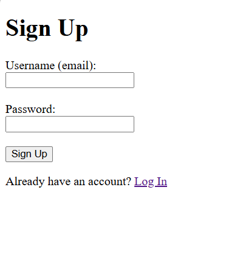
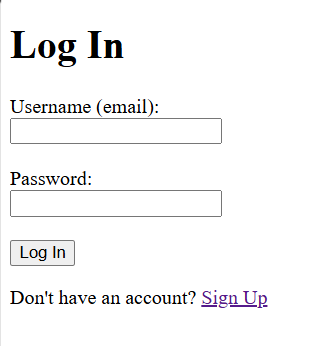
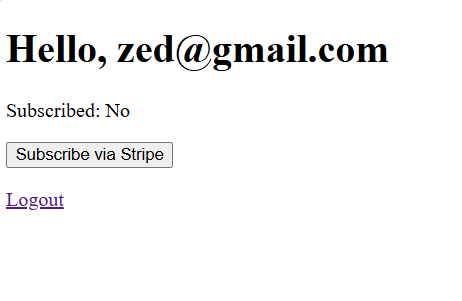
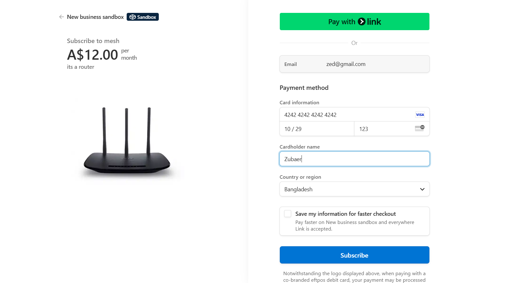
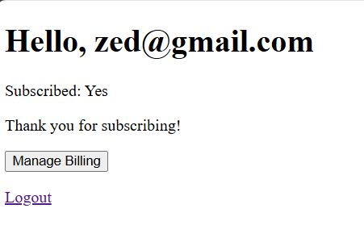
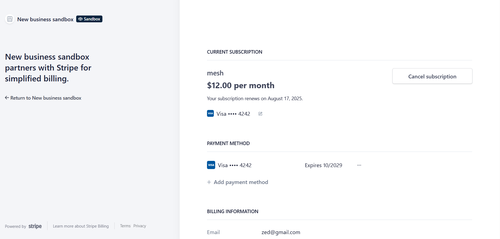

A complete authentication and subscription management system built with FastAPI, integrating JWT authentication and Stripe payments.

## ✨ Features

- ✅ Secure user registration and login
- ✅ JWT authentication with refresh tokens
- ✅ Password hashing with bcrypt
- 💳 Stripe subscription payments
- 🏦 Stripe billing portal integration
- 🔔 Webhook handling for real-time updates
- 🖥️ Ready-to-use frontend templates
- 🗄️ PostgreSQL/SQLite database support

## 🚀 Quick Start

### Prerequisites
- Python 3.7+
- Stripe account
- PostgreSQL 

### Installation
```bash
# Clone the repository
git clone https://github.com/yourusername/fastapi-stripe.git
cd auth-subscription-api

# Create virtual environment
python -m venv venv
source venv/bin/activate  # Linux/Mac
venv\Scripts\activate    # Windows

# Install dependencies
pip install -r requirements.txt

# Set up environment variables
cp .env.example .env
# Edit .env with your credentials

# Run the application
uvicorn main:app --reload

# Auth & Subscription API with FastAPI and Stripe


A complete authentication and subscription management system with Stripe integration.

## 📸 Visual Walkthrough

### 1. Welcome Screen


Start by choosing to **Sign Up** or **Log In**

---

### 2. Registration


**Steps:**
1. Enter your email as username
2. Create a secure password
3. Click "Sign Up" button

---

### 3. Login


**Steps:**
1. Enter your registered email
2. Input your password
3. Click "Log In" button

---

### 4. User Dashboard (Unsubscribed)


**Features:**
- View account status
- "Subscribe via Stripe" button appears when unsubscribed
- Logout option

---

### 5. Stripe Checkout


**Test Payment:**
- Card: `4242 4242 4242 4242`
- Exp: `10/29`
- CVC: `123`
- Click "Subscribe"

---

### 6. User Dashboard (Subscribed)


**New Features:**
- Status updates to "Subscribed: Yes"
- "Manage Billing" button appears
- Thank you message

---

### 7. Billing Portal


**Capabilities:**
- View subscription details
- Update payment method
- Cancel subscription
- See next billing date
